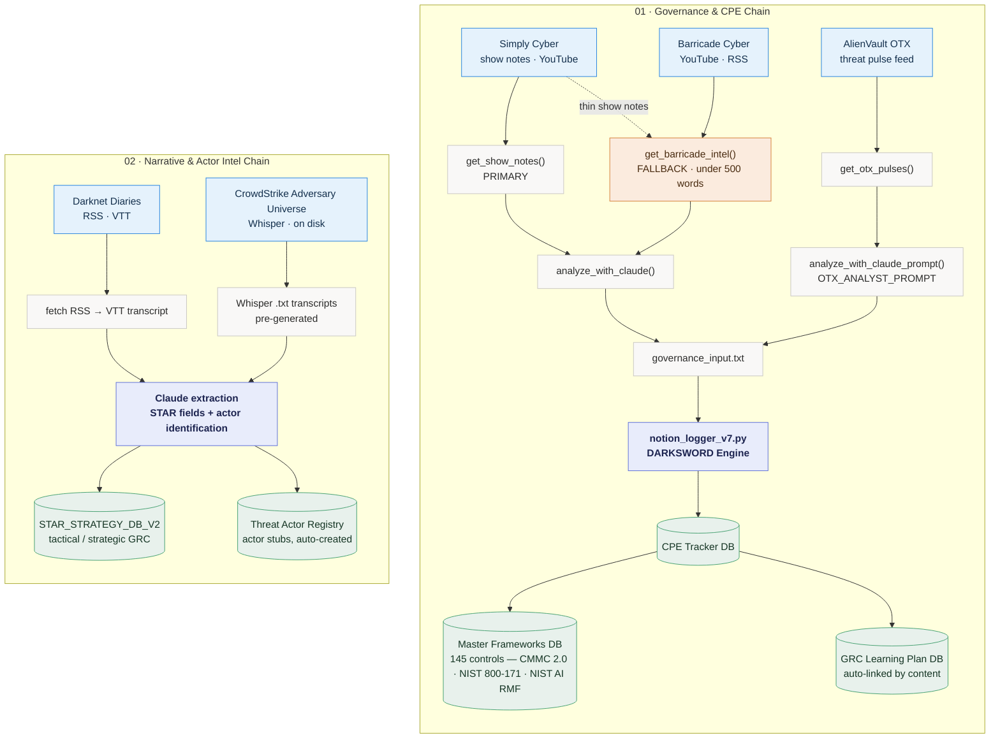

# ⚔️ Project DARKSWORD — GRC Intelligence Platform
### Threat Intelligence → CMMC 2.0 Gap Analysis — Automated

A multi-source intelligence pipeline that ingests daily security content from podcast feeds, threat feeds, and YouTube, classifies it using Claude AI, maps it against CMMC 2.0 / NIST 800-171 controls, links records to a live GRC learning plan, and pushes structured records into a Notion GRC repository.

Built as part of the STAR Project (Self-Transformation through Adversarial Rigor) — a hands-on vCISO development program. Manual mastery first, automation second.

---

## Why DARKSWORD

The asymmetry is real.

Nation-state actors and ransomware operators are already leveraging AI to scale attacks, accelerate reconnaissance, and craft more convincing social engineering — at a pace no human analyst can match alone.

DARKSWORD exists to close that gap.

A solo GRC analyst with a spreadsheet isn't a fair fight against an AI-augmented adversary. But a GRC analyst running an autonomous intelligence pipeline that ingests multiple threat feeds daily, maps every story to CMMC 2.0 controls, maintains a living audit trail, and surfaces critical threat intensity across 145 controls — that's a different posture entirely.

This project is proof that defenders can use the same technology to build leverage. Not to replace analyst judgment — but to amplify it.

The threat actors aren't waiting. Neither should you.

---

## Architecture

DARKSWORD runs two independent ingestion chains. Both terminate in Notion databases that
serve as the durable system of record for CPE, framework mapping, and adversary tracking.



### Pipeline notes

| Stage | Governance &amp; CPE Chain | Narrative &amp; Actor Intel Chain |
| --- | --- | --- |
| Sources | Simply Cyber show notes, AlienVault OTX pulses | Darknet Diaries RSS, CrowdStrike Adversary Universe |
| Collection | `get_show_notes()` with `get_barricade_intel()` fallback when show notes run under 500 words; `get_otx_pulses()` | RSS to VTT transcript fetch; pre-generated Whisper `.txt` transcripts |
| Analysis | `analyze_with_claude()` and `analyze_with_claude_prompt()` using `OTX_ANALYST_PROMPT` | Single Claude extraction pass for STAR fields and actor identification |
| Handoff | `governance_input.txt` | in-memory, no intermediate file |
| Engine | `notion_logger_v7.py` (DARKSWORD Engine) | Claude extraction writes directly |
| Destinations | CPE Tracker DB, then Master Frameworks DB (145 controls — CMMC 2.0, NIST 800-171, NIST AI RMF) and GRC Learning Plan DB | STAR_STRATEGY_DB_V2 and Threat Actor Registry |

<details>
<summary>Static diagram (rendered infographic)</summary>


Interactive version: [`darksword-pipeline.html`](docs/assets/darksword-pipeline.html)

</details>

---

## Databases (Notion)

| Database | Script | Source | Purpose |
|---|---|---|---|
| CPE Tracker | `notion_logger_v7.py` | Simply Cyber, AlienVault OTX, Barricade Cyber | Tactical threat intel, CMMC mapping |
| STAR Strategy DB V2 | `darknetdiaries_ingest.py`, `crowdstrike_ingest.py` | Darknet Diaries, CrowdStrike Adversary Universe | Strategic GRC intel, actor-linked |
| Threat Actor Registry | `darknetdiaries_ingest.py`, `crowdstrike_ingest.py` | Auto-created from ingest | Actor stubs with classification and aliases |
| Master Frameworks | shared | CMMC 2.0 / NIST 800-171 / NIST AI RMF (145 controls) | Control mapping source of truth |
| GRC Learning Plan | shared | Internal | Auto-linked from control domains |

---

## Workspace Structure

```
C:\Work\GRC\darksword\
├── notion_logger_v7.py              ← DARKSWORD core engine (CPE Tracker pipeline)
├── star_threat_ingest.py            ← STAR Strategy pipeline (Barricade legacy + STAR fields)
├── darknetdiaries_ingest.py         ← Darknet Diaries → STAR + Threat Actor Registry
├── crowdstrike_ingest.py            ← CrowdStrike Adversary Universe → STAR + Registry
├── gemini_ingest_tool.py            ← Standalone Gemini YouTube transcription tool
├── run_darksword_auto.ps1           ← Task Scheduler: Simply Cyber daily
├── run_darksword_otx.ps1            ← Task Scheduler: AlienVault OTX
├── run_darksword_barricade.ps1      ← Task Scheduler: Barricade Cyber
├── data/
│   └── crowdstrike_transcripts/     ← Whisper .txt transcripts (7 adversary episodes)
├── docs/
│   ├── handovers/                   ← Session handover docs
│   ├── cold-starts/                 ← Cold-start pilot lessons
│   ├── persona-workflow/            ← AO persona model, approval gates
│   ├── security-campaign/           ← Security campaign docs
│   └── changelogs/                  ← Project changelogs
├── prompts/                         ← Analyst prompt library
├── archive/                         ← Legacy scripts
├── GRC-Playground/                  ← Experimental work
├── .env                             ← API keys (gitignored)
├── governance_input.txt             ← Working file (gitignored)
├── barricade_last_ingested.txt      ← Barricade dedup state (gitignored)
├── failed_records.txt               ← Failed push log
├── requirements.txt
└── README.md
```

---

## Pipeline Modes

### DARKSWORD (`notion_logger_v7.py`) — CPE Tracker Pipeline

```
cpe   # launches via alias
```

| Choice | Description | Source Label |
|---|---|---|
| 1. Autonomous Pipeline | Show Notes → Claude → Notion (prompts for date) | Simply Cyber Daily Threat Brief |
| 2. Manual Pipeline | `governance_input.txt` → Notion | (user-specified) |
| 3. Test Pipeline | Mock data → Notion (`--test` flag only) | — |
| 4. OTX Pipeline | AlienVault OTX → Claude → Notion | AlienVault OTX |
| 5. RSS Feed Pipeline | RSS auto-detect date → Show Notes → Claude → Notion | Simply Cyber Daily Threat Brief |
| 6. Barricade Cyber | YouTube URL → Transcript → Claude → Notion | Barricade Cyber |
| 7. Simply Cyber YouTube | YouTube URL → Transcript → Claude → Notion | Simply Cyber Daily Threat Brief |
| 8. Gemini YouTube Ingest | YouTube URL → Gemini transcript → Claude → Notion | (user-selected) |

### Darknet Diaries Pipeline (`darknetdiaries_ingest.py`)

Fetches RSS, pulls VTT transcripts, runs Claude extraction per episode, resolves threat actors against the Threat Actor Registry, and pushes to STAR_STRATEGY_DB_V2. 168/173 episodes ingested (173/179 had VTT transcripts, 6 had none).

```bash
python darknetdiaries_ingest.py --dry-run       # preview without writing
python darknetdiaries_ingest.py                 # live run (incremental via Episode Number cursor)
python darknetdiaries_ingest.py --limit N       # process N episodes only
```

### CrowdStrike Adversary Universe Pipeline (`crowdstrike_ingest.py`)

Reads pre-generated Whisper transcripts from `data/crowdstrike_transcripts/`, runs Claude extraction, resolves actors against the Threat Actor Registry, and pushes to STAR_STRATEGY_DB_V2. Scoped to 7 adversary-profile episodes (ALL-CAPS actor name in title).

```bash
python crowdstrike_ingest.py --dry-run          # preview without writing
python crowdstrike_ingest.py                    # live run
```

### Non-interactive flags (Task Scheduler)

| Flag | Pipeline | Log file |
|---|---|---|
| `--auto` | RSS date detect → show notes → Claude → Notion (with <500-word YouTube fallback) | `darksword_YYYY-MM-DD.log` |
| `--auto-otx` | AlienVault OTX → Claude → Notion | `darksword_otx_YYYY-MM-DD.log` |
| `--auto-barricade` | Barricade RSS → transcript → Claude → Notion | `darksword_barricade_YYYY-MM-DD.log` |

---

## Intelligence Sources

| Source | Channel | Focus | Status |
|---|---|---|---|
| Simply Cyber | Show Notes | Daily tactical threat briefs | ✅ Live (auto + interactive) |
| AlienVault OTX | Threat Feed | IOC feeds, pulse intelligence | ✅ Live (auto + interactive) |
| Barricade Cyber | YouTube | DFIR, MSP/enterprise ops | ✅ Live (auto + interactive) |
| Darknet Diaries | RSS/VTT | Deep-dive threat actor narratives | ✅ Live — 168/173 episodes ingested |
| CrowdStrike Adversary Universe | Whisper/disk | Adversary profiles (SPIDER, PANDA, CHOLLIMA taxonomy) | ✅ Live — 7 adversary episodes ingested |
| Cybernews | YouTube | Threat actor profiles | ⏸ Parked — feed dormant since May 2025; 88-episode backfill queued |

---

## Quick Start

```bash
git clone https://github.com/tmon3ygrc-sentinel/darksword.git
cd darksword
python -m venv .venv
source .venv/Scripts/activate    # Windows Git Bash
pip install -r requirements.txt
cp .env.example .env
```

Fill in `.env`:

```
# Core
NOTION_TOKEN=secret_...
DATABASE_ID=...                  # CPE Tracker
CMMC_DATABASE_ID=...             # Master Frameworks
ANTHROPIC_API_KEY=sk-ant-...
OTX_API_KEY=...                  # AlienVault OTX
GEMINI_API_KEY=...               # Gemini API (Choice 8)

# Learning Plan Weeks
LEARNING_WEEK_1=...
LEARNING_WEEK_2=...
...
```

Set the `cpe` alias in `~/.bashrc`:

```bash
alias cpe='cd /c/Work/GRC/darksword && /c/Work/GRC/.venv/Scripts/python.exe notion_logger_v7.py'
```

### Security: activate the pre-commit hook

```bash
git config core.hooksPath .githooks
```

Requires `gitleaks` on PATH. Scans staged changes and blocks commits containing secrets.

---

## Key Dependencies

- `notion-client==2.2.1` — pinned. Later versions break the synchronous pipeline. Do not upgrade without testing.
- `google-genai` — required for Choice 8 and `gemini_ingest_tool.py`. Uses `gemini-2.0-flash`.
- `youtube-transcript-api` — used by `get_barricade_intel()` and the Simply Cyber YouTube fallback.
- `openai-whisper` — used for CrowdStrike transcription (Colab, not local). Not in `requirements.txt` — install in Colab only.

---

## CMMC Cache

The script queries the Master Frameworks database at launch and builds an in-memory cache indexed by `NIST 800-171 Ref`. Master Frameworks holds **145 rows total**, spanning CMMC 2.0 (142), NIST 800-171 Rev 3 (2), and NIST AI RMF (1). The cache reports **123 distinct NIST refs** — lower than the row count because the `NIST 800-171 Ref` property strips the domain/level prefix, so CMMC L1/L2 pairs citing the same underlying control (e.g. `AC.L1-3.1.1` and `AC.L2-3.1.1`) share one ref key; `resolve_control()` disambiguates by maturity level. One row (`MAP.1.5`, NIST AI RMF) has no NIST 800-171 ref and is correctly excluded from the cache.

`normalize_cid()` strips whitespace and normalizes case before cache lookups. Unresolved IDs are tracked in `CMMC_MISSES` and printed post-run.

---

## Learning Plan Auto-Mapping

Every CPE Tracker record is automatically linked to relevant GRC learning plan weeks based on `control_domains` and `intel_category`.

| Control Domain | Learning Weeks |
|---|---|
| Incident Response (IR) | Week 23 |
| Supply Chain Risk Management (SR) | Week 19, Week 29 |
| Risk Assessment (RA) | Week 18, Week 20 |
| Access Control (AC) | Week 13 |
| Identification and Authentication (IA) | Week 13 |
| Configuration Management (CM) | Week 12 |
| System Integrity (SI) | Week 17 |
| System and Communications Protection (SC) | Week 17 |
| Security Awareness and Training (AT) | Week 5 |
| Audit and Accountability (AU) | Week 27, Week 28 |

---

## Roadmap

- [x] DARKSWORD v6 — Claude-powered tactical intel pipeline
- [x] Manual Pipeline — standard workflow for Simply Cyber content
- [x] CMMC relation mapping (128 controls)
- [x] Learning plan auto-detection (29 weeks)
- [x] DARKSWORD v7 — `get_show_notes()` replaces YouTube scraping
- [x] Autonomous Pipeline (Choice 1) — Simply Cyber show notes
- [x] OTX Pipeline (Choice 4) — AlienVault threat feed
- [x] RSS Feed Pipeline (Choice 5) — auto-detects episode date
- [x] `--auto`, `--auto-otx`, `--auto-barricade` flags — Task Scheduler
- [x] Barricade Cyber pipeline (Choice 6)
- [x] Word count gate in `--auto` — YouTube fallback if <500 words
- [x] Gemini YouTube Ingest (Choice 8)
- [x] `star_threat_ingest.py` — STAR Strategy pipeline, migrated from AdminOps (2026-08)
- [x] STAR_STRATEGY_DB_V2 Threat Actors relation — Threat Actor Registry linked
- [x] `resolve_actor()` — auto-create actor stubs with alias dedup
- [x] `sanitize_multi_select()` — comma-in-option Notion API fix
- [x] Darknet Diaries ingest — 168/173 episodes pushed to STAR (2026-08)
- [x] CrowdStrike Adversary Universe ingest — 7 adversary episodes, Whisper transcription (2026-08)
- [x] Master Frameworks expanded to 145 controls via FORGE Track 1 (2026-08)
- [x] `run_darksword_darknetdiaries.ps1` — Task Scheduler wrapper for DD incremental runs
- [x] Cybernews 88-episode backfill — one-time historical sweep (feed parked, data valid)
- [x] CrowdStrike incremental monitoring — title classifier for new adversary-profile episodes
- [x] `load_cmmc_cache()` root cause trace — SR.L2-3.15.2 4x recurrence, debug-print needed

---

## Known Limitations

- **`get_transcript()` blocked for Simply Cyber** — yt-dlp is blocked at the network/IP level. V7 uses `get_show_notes()` instead; `--auto` falls back to `get_barricade_intel()` (YouTubeTranscriptApi). `get_transcript()` retained for reference only.
- **`unknown` threat actor shows empty in Notion** — placeholder values (`none`, `unknown`, `empty`, `n/a`) are skipped intentionally to prevent noise.
- **Darknet Diaries — 5 episodes skipped** — EP14, 174, 175, 177, 178 have no VTT transcript in the RSS feed. Whisper fallback deferred to v2.
- **CrowdStrike — 71 report/interview episodes out of scope** — only adversary-profile episodes (ALL-CAPS actor name in title) are ingested. Expansion requires a title classifier.
- **SR.L2-3.15.2 CMMC cache miss (recurring)** — root cause unresolved. Both Control Status filter hypothesis and emoji-in-Name hypothesis ruled out. Debug-print at runtime needed.

---

## License

MIT — Open source. Use it, fork it, build on it.

Built with HardOPS discipline. Manual mastery before automation. Eat your own cooking. ⚔️💎🦅
